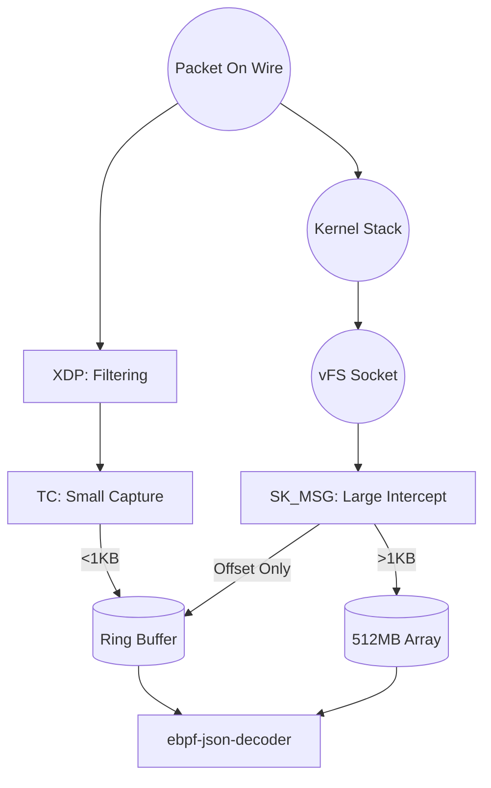

# eBPF JSON Intercept Pipeline Architecture

## The Vision: High-Performance, Zero-Impact Observation
The fundamental goal of this pipeline is to provide deep visibility into JSON traffic without the application ever knowing we are there. It is designed for **Real-Time Security Observability** on high-traffic servers.

---

## 1. The Lifecycle of a Packet: A Play-by-Play

To understand the architecture, let's follow a single JSON string sent to port 8080.

1.  **The Arrival (XDP)**: The packet hits the network card (NIC). Before the Linux Kernel even allocates a single byte for it, our **XDP Program** (`xdp_edge.bpf.c`) is triggered. It checks the IP and Port. If it doesn't match our config, it ignores it immediately. **Result**: Zero overhead for ignored traffic.
2.  **The Entry (TC)**: If the packet matches, it moves into the **Traffic Control (TC)** layer. Here, `tc_stateful.bpf.c` looks at the size.
    - **Path A (Small)**: If the packet is < 1KB, TC copies the data into the **Ring Buffer** and sends it straight to userspace.
    - **Path B (Large)**: If the data is large, TC ignores the payload and lets it move up to the Socket layer.
3.  **The Intercept (SK_MSG)**: As the application (like a Web Server) reads the data from its socket, our **SK_MSG Program** (`sk_msg_intercept.bpf.c`) wakes up. 
    - It intercepts the large payload *inside the socket buffer*.
    - It reserves a 64KB slot in our **512MB Fixed-Slot Array**.
    - It copies the data into that slot and sends an "alert" (a small event with an offset) to userspace.
4.  **The Processing (Rust Decoder)**: The **Rust Decoder** receives the alert from the Ring Buffer. It uses the provided `offset` to look directly into the shared memory slot. It parses the JSON and outputs the logs.

---

## 2. Design Strategy: Why the Dual Path?

Why not use the same path for everything? Because networking has different constraints at different layers.

### The Ring Buffer (For Speed & Noise)
- **Used by**: TC and XDP.
- **Why**: It is blazingly fast but requires fixed-size events. 
- **Analogy**: A high-speed conveyor belt for small boxes. If a box is too big, the belt jams.

### The Fixed-Slot Array (For Depth & Large Data)
- **Used by**: SK_MSG.
- **Why**: Large payloads (up to 64KB) are too big for the conveyor belt. We instead put them into a "Parking Garage" (the 512MB shared array). We only send a tiny "Parking Ticket" (the offset) over the conveyor belt.
- **Analogy**: We leave the heavy pallet in the warehouse and just hand the forklift operator a slip of paper telling them which shelf to look at.

---

## 3. Map Structures: The "Storage Closets"

eBPF programs are stateless, so they use **Maps** to share data.

| Map Name | Type | Purpose |
| :--- | :--- | :--- |
| `port_proto_filter` | **HASH** | A dictionary of ports we care about (e.g., 443, 8080). |
| `large_payload_array` | **ARRAY** | The 512MB shared memory block (The "Parking Garage"). |
| `log_ringbuf` | **RINGBUF** | The communication channel from Kernel to Rust. |
| `sockmap` | **SOCKHASH** | A "phone book" of all active TCP connections. |

---

## 4. Component Flow Diagrams

### Phase 1: Setup & Configuration
```mermaid
graph LR
    YAML[config/intercept.yaml] --> Loader[ebpf-json-loader]
    Loader --> MapFilter[(Port Filter Map)]
    Loader --> MapShared[(Shared Array)]
    Loader -- Pins Maps --> FS[/sys/fs/bpf/...]
```

### Phase 2: Real-Time Interception


---

## 5. Security & Safety First
The pipeline is designed to be "Fail-Passive":
- If the Ring Buffer is full, it drops the *log*, not the *packet*.
- If the Shared Memory is full, it wraps around (Circular Buffer), ensuring we only lose old logs, not new network connections.
- **Safety Switch**: The loader monitors its own health. If it dies, it unloads the filters to ensure the server remains reachable.