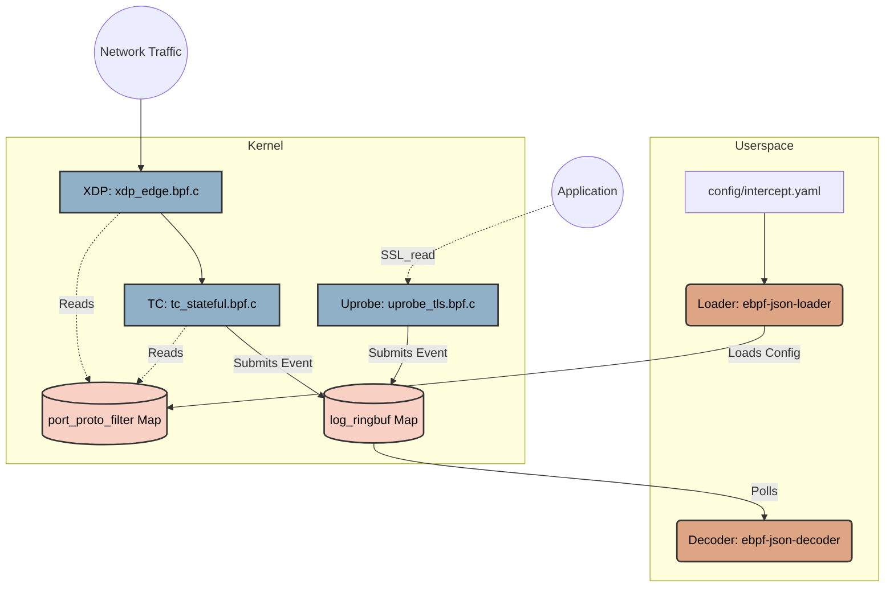

# eBPF JSON Intercept Pipeline Architecture

## Core Principle: Passive Intercept Pipeline
The fundamental design principle of this system is that it operates as a **Passive Intercept Pipeline**. The pipeline is strictly observational; it must never drop, delay, or modify non-matching traffic. Its sole purpose is to safely duplicate and inspect matching network payloads for JSON data without impacting the critical path of the network stack.

---

## Kernel Components (eBPF C)

The kernel-space components are responsible for high-performance, low-overhead packet inspection and capture.

### 1. `xdp_edge.bpf.c` (Layer 1 XDP)
This is the first line of defense, attaching at the eXpress Data Path (XDP) layer for maximum performance.
- **Functionality:** Parses Ethernet, VLAN, IPv4/IPv6, TCP, and UDP headers.
- **Filtering:** Checks incoming traffic against an IP allowlist using an LPM (Longest Prefix Match) trie and validates ports/protocols against YAML-configured filters.
- **Protection:** Performs rate limiting to prevent overwhelming the userspace components.
- **Action:** Always returns `XDP_PASS` to ensure traffic continues uninterrupted, regardless of whether it matches the filters.

### 2. `tc_stateful.bpf.c` (Layer 1 TC)
Attaches at the Traffic Control (TC) layer to perform deeper, stateful inspection.
- **Functionality:** Extracts the application payload up to a maximum of 1024 bytes (`MAX_LOG_CHUNK_SIZE`).
- **Data Capture:** Uses the `bpf_skb_load_bytes` helper to safely copy the payload into a ring buffer event structure (`log_event_t`).
- **Export:** Submits the captured event to the BPF Ring Buffer for asynchronous userspace consumption.

### 3. `uprobe_tls.bpf.c` (Layer 2 Capture)
Designed for capturing encrypted traffic before it hits the network stack (or after decryption).
- **Functionality:** Uses uprobes to hook into OpenSSL's `SSL_read` (and potentially `SSL_write`) functions.
- **Data Capture:** Captures plaintext JSON payloads before they are encrypted or after they are decrypted by the application.
- **State Management:** Utilizes an LRU (Least Recently Used) hash map for state tracking across function calls and per-CPU arrays for staging data efficiently.

### 4. BPF Arena Memory Management (Shared)
For large payloads that exceed the 1024-byte `log_event_t` limit, the pipeline utilizes **BPF Arena** (introduced in Linux 6.9).
- **Fixed-Size Circular Buffer:** Instead of complex dynamic allocation, the pipeline manages a **1GB circular buffer** within a 4GB Arena. This ensures deterministic memory usage and high performance.
- **Head Offset Tracking:** The kernel tracks the current write position using the `arena_state_map`.
- **Atomic Increments:** To handle concurrent packets across multiple CPU cores safely, the kernel uses `__sync_fetch_and_add` to atomically increment the head pointer and reserve space.
- **Relative Offsets:** The kernel calculates the relative offset from the Arena's base pointer and sends only this offset to userspace. This prevents 32-bit pointer truncation and ensures compatibility with different memory layouts.

---

## Userspace Components (Rust)

The userspace components manage the lifecycle of the eBPF programs, provide configuration, and process the captured data.

### 1. Loader (`userspace/loader` -> `ebpf-json-loader`)
The control plane for the pipeline.
- **Configuration:** Parses rules and filters from `config/intercept.yaml`.
- **Safety Mechanisms:** 
  - Implements active SSH session detection to prevent locking out administrators.
  - Features a 5-minute "dead man's switch" to automatically unload the pipeline if the loader crashes or is ungracefully terminated.
- **Deployment:** 
  - Loads the compiled BPF objects into the kernel.
  - Pins shared maps (e.g., `log_ringbuf`, `port_proto_filter`) to the BPF virtual file system at `/sys/fs/bpf/ebpf-json-pipeline` for cross-process access.
  - Maps the BPF Arena into userspace memory, providing the base pointer to the Decoder.
  - Safely attaches the TC program first, followed by the XDP program to ensure the pipeline is fully ready before edge traffic is processed.

### 2. Decoder (`userspace/decoder` -> `ebpf-json-decoder`)
The data plane consumer.
- **Connection:** Attaches to the pinned `log_ringbuf` map created by the Loader.
- **Processing:** Runs a highly optimized, dedicated thread for polling events from the ring buffer.
- **Decoding:** 
  - Safely casts raw ring buffer bytes to the `log_event_t` structure.
  - Extracts the dynamic payload length.
  - **Arena Resolution:** If the event indicates an Arena-backed payload, the decoder adds the relative offset to its local mmap base pointer to resolve the absolute memory address.
  - **Safety Checks:** Implements strict Rust-level bounds checking to ensure `offset + data_len <= 4GB` before attempting to read from the Arena, protecting against kernel-side corruption or malformed offsets.
  - Parses the payload as JSON using `simd-json` (leveraging AVX2 instructions for speed) or falling back to `serde_json`.

---

## eBPF-to-Rust Interaction Boundary

The interaction between the kernel eBPF programs and the Rust userspace components is critical for performance and safety.

### Architecture Flow Diagram



### Control Flow (Configuration)
1. The **Rust Loader** reads `config/intercept.yaml`.
2. It updates the `port_proto_filter` BPF Hash Map with the parsed rules.
3. The **XDP and TC programs** read this map for every packet to make fast, in-kernel decisions about whether to intercept and copy the payload.

### Data Flow (Capture)
1. Packets arrive and are processed by XDP/TC, or application buffers are intercepted by Uprobes.
2. Matching payloads are packaged into a `log_event_t` struct and submitted to the `log_ringbuf` BPF Ring Buffer.
3. The **Rust Decoder** continuously polls `log_ringbuf`, retrieves the raw bytes, and processes the JSON.

### C Struct Mapping (The Contract)
For the Rust Decoder to safely parse the data coming from the kernel, there must be a strict memory layout agreement. The Rust side relies on an exact `#[repr(C)]` match of the kernel's `log_event_t`.

**Kernel (C):**
```c
#define MAX_LOG_CHUNK_SIZE 1024

typedef struct {
    __u32 conn_id;
    __u32 pid;
    __u32 tid;
    __u64 ts_ns;
    __u8  is_arena_ptr;
    __u8  pad[3];
    __u32 arena_offset;
    __u32 data_len;
    __u8  data[MAX_LOG_CHUNK_SIZE];
} log_event_t;
```

**Userspace (Rust):**
```rust
const MAX_LOG_CHUNK_SIZE: usize = 1024;

#[repr(C)]
#[derive(Debug, Clone, Copy)]
pub struct LogEvent {
    pub conn_id: u32,
    pub pid: u32,
    pub tid: u32,
    pub ts_ns: u64,
    pub is_arena_ptr: u8,
    pub pad: [u8; 3],
    pub arena_offset: u32,
    pub data_len: u32,
    pub data: [u8; MAX_LOG_CHUNK_SIZE],
}
```
// Inside the decoder ring buffer callback:
// The decoder casts the raw byte slice to this struct, safely reads the
// header fields (pid, tid, ts_ns), and then slices the `data` array exactly 
// up to `data_len` to avoid parsing trailing garbage before handing it to simd-json.
```it to simd-json.
```